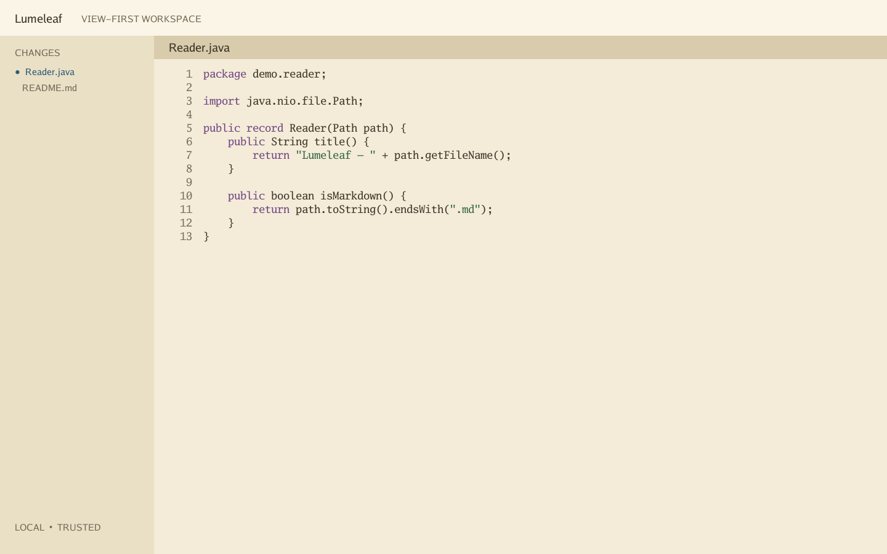

# Lumeleaf

**A fast, native, view-first workspace for understanding agent-written Java and Markdown.**



Lumeleaf is a stable, local-first reader for the part of software development that AI agents make more important: seeing exactly what changed, following structure, and deciding whether the result is right. It deliberately avoids an extension host, embedded browser, terminal, debugger, and built-in AI chat.

> **Development disclosure:** This project was generated with OpenAI Codex 5.6 Sol using high reasoning effort. It is primarily intended for the author's personal use. Review and test the code before relying on it.

## Lumeleaf 1.0

Lumeleaf 1.0 is intentionally a focused code reader rather than a replacement for a write-heavy IDE. Its supported core is opening Java and Markdown quickly, retaining a calm layout, and supplying review-oriented workspace services without a runtime language server.

Implemented today:

- Native Gio window for Linux and macOS, plus a deterministic headless renderer.
- Direct Java and Markdown file opening with dark, light, and sepia palettes.
- Tree-sitter Java parsing, visible-range syntax spans, folds, and local symbols.
- Native Markdown document model with GFM tasks, tables, fenced code, and safe resource rules—no WebView.
- Revisioned Unicode document model, undo/redo, atomic conflict-aware saves, and UTF-16 position mapping.
- Memory-mapped, sparse-indexed large-file reader.
- Incremental workspace discovery, Quick Open ranking, streaming search through `rg` or a Go fallback, and disk reconciliation.
- Read-only Git status/diff parsing and local review state foundations.
- Reproducible visual fixtures, race-tested packages, fuzz targets, and benchmark gates.

Java parsing, symbols, folds, and syntax roles are built into the executable. Lumeleaf does not require Java, a JDK, JDT LS, Node.js, Python, Electron, a browser engine, an account, or a network connection.

## Why view-first?

Agent workflows produce changes faster than people can responsibly inspect them. Lumeleaf optimizes for opening first, reading without layout churn, moving through changed hunks, and noticing external edits. Language servers and repository analysis are optional background layers; they never block the first readable frame.

## Install

Download the installers and binaries from the [latest Lumeleaf release](https://github.com/itishrishikesh/lumeleaf/releases/latest):

- macOS Apple Silicon: `Lumeleaf-1.0.1-macos-arm64.dmg`
- macOS Intel: `Lumeleaf-1.0.1-macos-amd64.dmg`
- Debian/Ubuntu x86-64: `lumeleaf_1.0.1_amd64.deb`
- Portable Linux x86-64: `lumeleaf-1.0.1-linux-amd64.tar.gz`
- Raw executables for all three supported targets

Every release includes `SHA256SUMS.txt`. The macOS app is ad-hoc signed; because it is not Apple-notarized, first launch may require approval in Privacy & Security.

The portable Linux bundle installs for the current user without root:

```bash
tar -xzf lumeleaf-1.0.1-linux-amd64.tar.gz
cd lumeleaf-1.0.1-linux-amd64
./install.sh
```

## Open a file or project

Launch Lumeleaf, enter a file or directory in the path field, then select **Open File** or **Open Project**. Pressing Enter automatically detects whether the path is a file or directory. Once a project is open, select any indexed text file from the project sidebar. `Ctrl/⌘ O` focuses the path field.

You can also open a path directly:

```bash
lumeleaf ./src/Main.java
lumeleaf ./my-project
```

## Build from source

Requirements: Go 1.25+, Git, a C compiler, and Gio's platform libraries.

Fedora:

```bash
sudo dnf install gcc pkg-config wayland-devel libX11-devel libxkbcommon-x11-devel mesa-libGLES-devel mesa-libEGL-devel libXcursor-devel vulkan-headers mesa-dri-drivers
make build
/tmp/lumeleaf README.md
```

macOS:

```bash
xcode-select --install
make build
/tmp/lumeleaf README.md
```

For core development or servers without graphics headers:

```bash
make build-headless
/tmp/lumeleaf --render-fixture testdata/java/Reader.java --theme sepia --output /tmp/lumeleaf.png
```

## Keyboard direction

The command registry defines the intended stable shortcuts while UI wiring is completed:

| Action | Shortcut |
|---|---|
| Open file | `Ctrl/⌘ O` |
| Quick Open | `Ctrl/⌘ P` |
| Search repository | `Ctrl/⌘ Shift F` |
| Toggle Markdown reading | `Ctrl/⌘ Shift M` |
| Next / previous change | `F7` / `Shift F7` |
| Go to definition | `F12` |

## Privacy and trust

Source stays on your machine. Lumeleaf has no telemetry, account, cloud dependency, bundled AI service, or external language-server process. Opening a workspace never launches a build wrapper, Git hook, formatter, remote image, or external link.

## Performance

Run `make bench-check` for short gates and `make bench-full` for repeatable microbenchmarks. The methodology and absolute budgets live in [benchmarks/README.md](benchmarks/README.md) and [benchmarks/budgets.json](benchmarks/budgets.json). The project does not claim numbers that have not been measured on a named machine.

## Verification

```bash
make verify
make visual
make smoke-headless
make bench-check
```

`make smoke-linux` additionally exercises the Gio path under a headless Weston compositor. CI builds and tests Linux, Intel macOS, and Apple Silicon macOS. Tagged releases build installers entirely on GitHub-hosted runners and publish checksums with each asset.

## Known limitations

- Lumeleaf 1.0 is a viewer: terminal, debugger, refactoring, extension hosting, and AI chat are deliberately outside its scope.
- Some workspace and Git review services are exposed as stable internal components before receiving dedicated GUI panels.
- Large-file mode is read-only.
- macOS applications are ad-hoc signed but not Apple-notarized.
- Screen-reader semantics have a tested platform-neutral model, but native assistive-technology testing is incomplete.
- Linux distributions outside the Debian family should use the portable bundle or raw binary.

## Project policy

Contributions are welcome under [CONTRIBUTING.md](CONTRIBUTING.md). Please report vulnerabilities according to [SECURITY.md](SECURITY.md). Participation is governed by [CODE_OF_CONDUCT.md](CODE_OF_CONDUCT.md).

Lumeleaf is available under the [MIT License](LICENSE). Third-party licenses remain with their respective authors; see [THIRD_PARTY_NOTICES.md](THIRD_PARTY_NOTICES.md).
